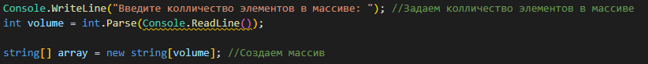
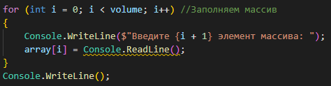
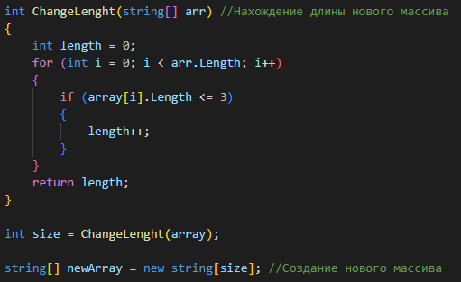
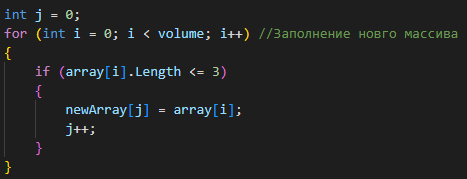
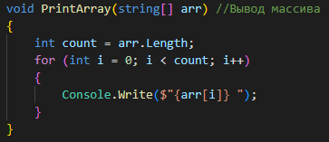
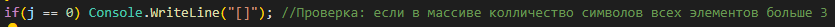

# ИТОГОВАЯ РАБОТА

Задача: Написать программу, которая из имеющегося массива строк формирует новый массив из строк, длина которых меньше, либо равна 3 символам. Первоначальный массив можно ввести с клавиатуры, либо задать на старте выполнения алгоритма. При решении не рекомендуется пользоваться коллекциями, лучше обойтись исключительно массивами.

**1. Создание массива**

1.1 Задаем размер первоначального массива с консоли

1.2 Заполняем массив с консоли

**2. Находим длину нового массива с помощью функции**

**3. Заполняем новый массив**

**4. Выводим новый массив в консоль**

*Если в массиве все элементы с колличеством символов больше 3*

